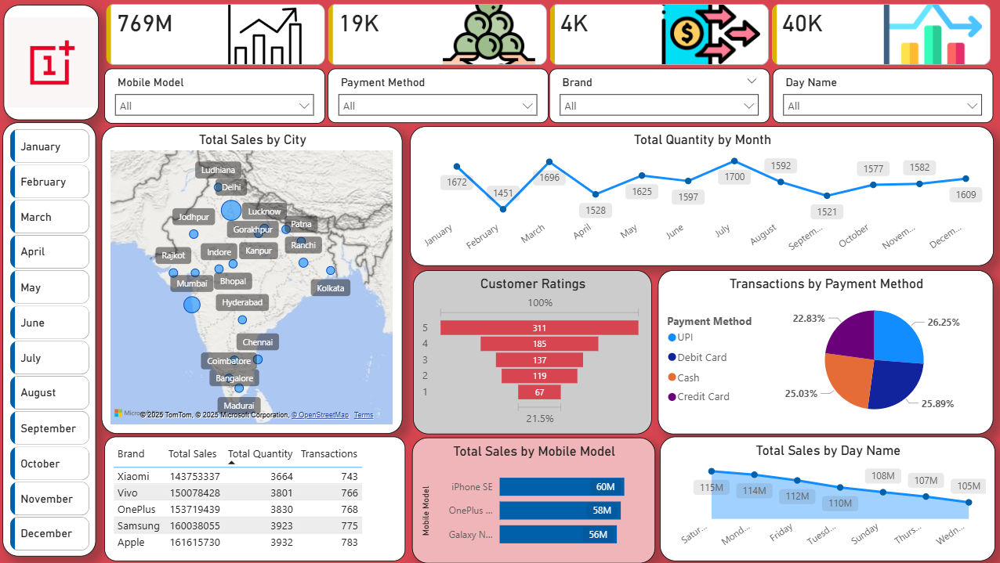

# Mobile-Sales-PowerBI
Interactive Power BI dashboard analyzing mobile sales across India with insights on brands, cities, customer ratings, payment methods, and time-based trends.

# 📊 Mobile Sales Analytics Dashboard – Power BI

---

## 📌 Project Overview
This project is an **interactive Power BI dashboard** designed to analyze and visualize **mobile phone sales data across India**.  
The dashboard provides deep insights into **sales performance, customer behavior, payment preferences, brand performance, and time-based trends**.

It helps **business stakeholders, sales managers, and analysts** make **data-driven decisions** using clear and interactive visualizations.

---

## 🎯 Objectives of the Project
- Analyze **overall mobile sales performance**
- Identify **top-performing brands and mobile models**
- Understand **city-wise sales distribution**
- Track **monthly and daily sales trends**
- Evaluate **customer ratings and satisfaction**
- Analyze **payment method preferences**
- Provide **interactive filters for dynamic analysis**

---

## 🛠 Tools & Technologies Used
- **Power BI Desktop**
- **Power Query** – Data transformation & cleaning
- **DAX (Data Analysis Expressions)** – Measures & calculations
- **Bing Maps / OpenStreetMap** – Geographical analysis
- **Excel / CSV** – Source dataset

---

## 📂 Dataset Description
The dataset contains the following attributes:

- Brand Name  
- Mobile Model  
- City  
- Month  
- Day Name  
- Sales Amount  
- Quantity Sold  
- Transactions  
- Customer Rating  
- Payment Method (UPI, Debit Card, Credit Card, Cash)

---

## 📈 Key KPIs
- **Total Sales:** 769M  
- **Total Transactions:** 19K  
- **Total Quantity Sold:** 4K  
- **Overall Sales Trend**

These KPIs dynamically update based on slicer selections.

---

## 🎛 Interactive Filters
- Brand  
- Mobile Model  
- Payment Method  
- Day Name  
- Month (January – December)

---

## 🌍 Dashboard Visuals Explained

### 📍 Total Sales by City (Map)
- Shows **city-wise sales across India**
- Bubble size represents **sales volume**
- Identifies high-performing cities like Mumbai, Delhi, Bangalore, and Hyderabad

---

### 📈 Total Quantity by Month (Line Chart)
- Displays **monthly quantity trend**
- Helps identify **seasonal demand patterns**

---

### ⭐ Customer Ratings (Funnel Chart)
- Distribution of ratings from **1 to 5**
- Majority of customers provided **4–5 star ratings**
- Indicates strong customer satisfaction

---

### 💳 Transactions by Payment Method (Pie Chart)
- UPI  
- Debit Card  
- Credit Card  
- Cash  

Shows dominance of **digital payment methods**.

---

### 🏷 Brand Performance (Table)
- Total Sales  
- Total Quantity  
- Number of Transactions  

Top brands:
- Apple  
- Samsung  
- OnePlus  
- Vivo  
- Xiaomi  

---

### 📱 Total Sales by Mobile Model (Bar Chart)
- Highlights **top-selling models**
- Helps understand **product-level demand**

---

### 📆 Total Sales by Day Name (Line Chart)
- Analyzes **weekday vs weekend sales**
- Useful for marketing and promotional planning

---

## 🧠 Key Insights
- Metro cities generate maximum revenue
- Digital payments dominate transactions
- Apple and Samsung lead in sales
- High customer satisfaction overall
- Sales show seasonal and weekday variations

---

## 📌 Use Cases
- Business Intelligence & Reporting  
- Sales & Marketing Strategy  
- Academic Projects  
- Power BI Portfolio  

---

## 🚀 How to Use
1. Download the `.pbix` file  
2. Open in **Power BI Desktop**  
3. Use slicers to explore insights  
4. Customize or extend as needed  

---

## 🧑‍💻 Author
**Adarsh Gupta**  
MCA Student 

---

## 📜 License
This project is intended for **educational and portfolio purposes**.  
Feel free to use and modify with proper credit.
